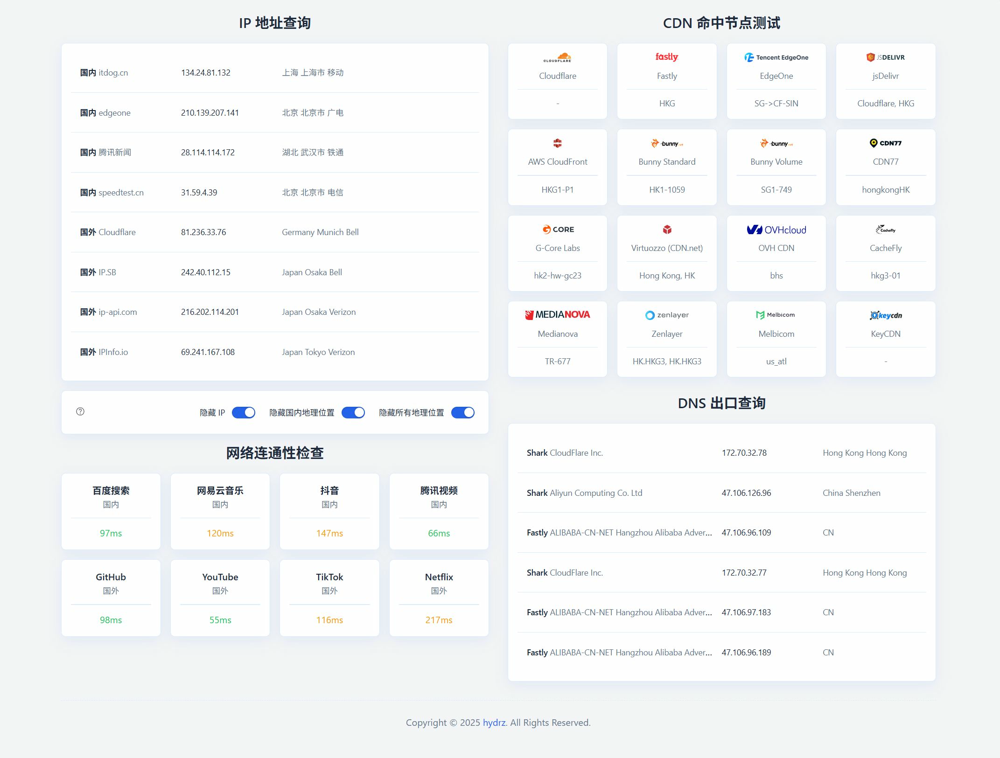
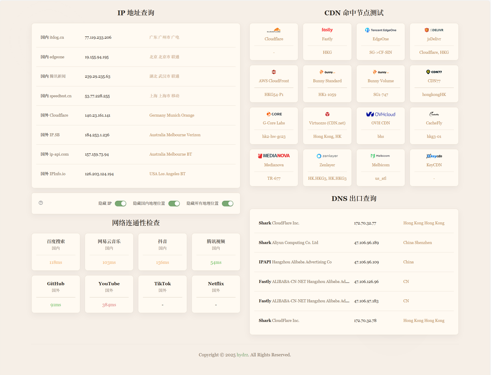
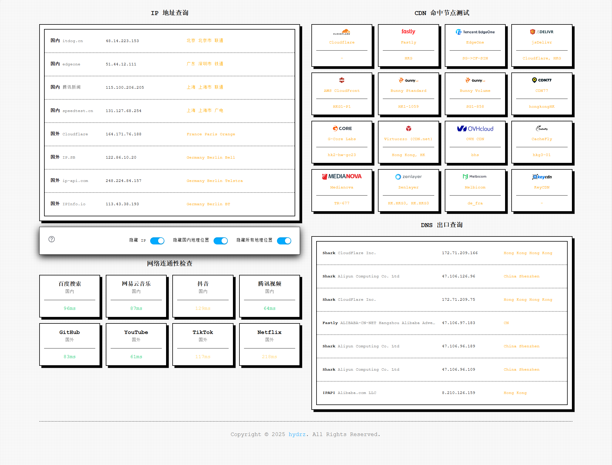

# IP 查询工具

这是 [https://ip.skk.moe/](https://ip.skk.moe/) 的复刻实现，提供 IP 地址查询、地理位置检测、DNS 出口分析、CDN 命中节点测试和网络连通性检查功能。所有数据通过浏览器前端获取，无需后端服务器。

## 主要功能

- **IP 地址查询**：支持多个国内外服务获取用户 IP 地址及地理位置信息，包括国家、省份、城市和 ISP。
- **网络连通性测试**：测试到各大网站的延迟（如百度、网易云音乐、GitHub 和 YouTube），并计算平均响应时间。
- **CDN 命中节点测试**：检测多个 CDN 提供商的命中节点，返回节点信息或位置。
- **DNS 出口查询**：分析 DNS 出口信息，包括服务商、运营商、IP 和位置，支持多服务聚合。



*图：项目主界面，展示 IP 查询、连通性测试和 CDN 结果。*

## 使用方式

### 方式一: 访问网站

- 在线访问: [https://ip.hydrz.cn](https://ip.hydrz.cn)


### 方式二：命令行（curl）

- 使用 curl 读取响应头自定义字段（示例见 [`examples/use-curl/main.sh`](examples/use-curl/main.sh)）：

```bash
curl -sI https://ip.hydrz.cn
```

### 方式三： 前端获取IP信息

- 在页面内嵌入 iframe 并通过 postMessage 获取数据（示例见 [`examples/use-html/index.html`](examples/use-html/index.html)）：

```html
<iframe src="https://ip.hydrz.cn/api" style="display:none"></iframe>
<script>
  const iframe = document.querySelector('iframe');
  iframe.onload = () => iframe.contentWindow.postMessage('ip', '*');

  window.addEventListener('message', (event) => {
    if (event.origin !== 'https://ip.hydrz.cn') return;
    if (event.data && event.data.error) {
      console.error(event.data.error);
      return;
    }
    console.log('IP data:', event.data);
  });
</script>
```

## 多主题

### 吉卜力



### 8bit



## 开发规范

- **代码风格**：遵循 JavaScript 编码规范，使用 Biome 格式化工具。

## 贡献指南

欢迎提交 Issue 和 Pull Request！请确保：
- 遵循现有代码风格。
- 添加必要的测试和文档。
- 更新 README 以反映更改。

## 许可证

本项目采用 MIT 许可证。详情请见 [LICENSE](LICENSE) 文件。

## 致谢

感谢原项目 [https://ip.skk.moe/](https://ip.skk.moe/) 的作者提供灵感和基础实现。本复刻项目在此基础上进行了优化和扩展。