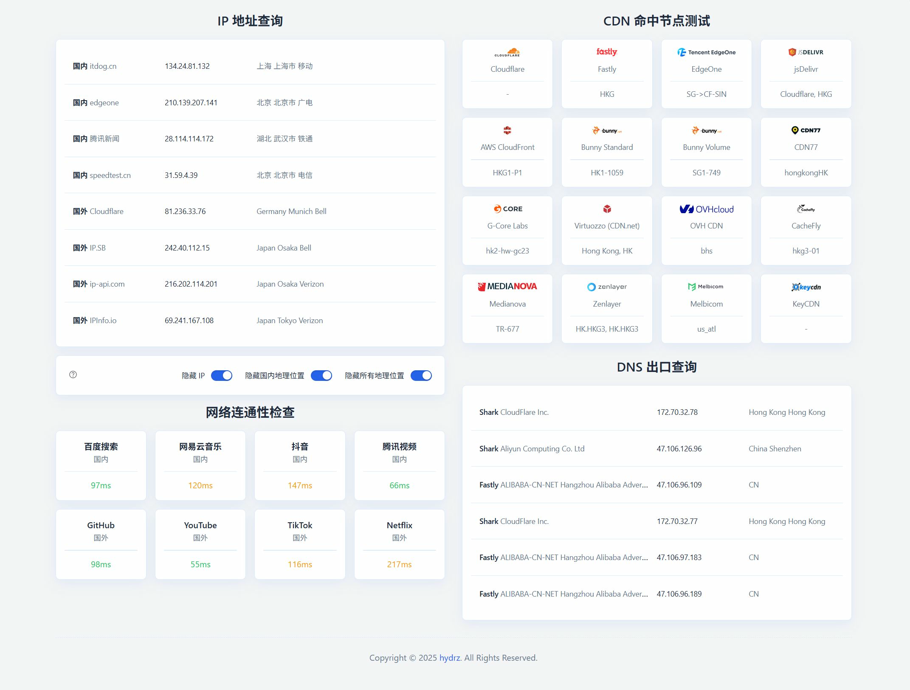

# IP 查询工具

这是 [https://ip.skk.moe/](https://ip.skk.moe/) 的复刻实现，提供 IP 地址查询、地理位置检测、DNS 出口分析、CDN 命中节点测试和网络连通性检查功能。所有数据通过浏览器前端获取，无需后端服务器。

## 主要功能

- **IP 地址查询**：支持多个国内外服务获取用户 IP 地址及地理位置信息，包括国家、省份、城市和 ISP。
- **网络连通性测试**：测试到各大网站的延迟（如百度、网易云音乐、GitHub 和 YouTube），并计算平均响应时间。
- **CDN 命中节点测试**：检测多个 CDN 提供商的命中节点，返回节点信息或位置。
- **DNS 出口查询**：分析 DNS 出口信息，包括服务商、运营商、IP 和位置，支持多服务聚合。



*图：项目主界面，展示 IP 查询、连通性测试和 CDN 结果。*

## 技术栈

- **前端**：HTML5、CSS3、JavaScript (ES6+)
- **部署**：Cloudflare Workers
- **工具**：Wrangler (Cloudflare CLI)、Biome (代码格式化)、Vite (构建工具)
- **API**：使用第三方 IP 查询服务和 CDN 测试端点，支持 JSONP 和 CORS
- **依赖**：Node.js >= 18, pnpm

## 支持的服务商

### IP 地址查询

| 服务商     | 类型 | 描述 |
| ---------- | ---- | ---- |
| itdog      | 国内 | 基于 itdog.cn API |
| edgeone    | 国内 | 基于 EdgeOne 服务 |
| tencent    | 国内 | 基于腾讯新闻 API |
| speedtest  | 国内 | 基于 speedtest.cn |
| cloudflare | 国外 | 基于 Cloudflare trace |
| ipsb       | 国外 | 基于 IP.SB API |
| ipapi      | 国外 | 基于 ip-api.com |
| ipinfo     | 国外 | 基于 IPInfo.io |

### CDN 命中节点测试

| 服务商              | 描述 |
| ------------------- | ---- |
| Cloudflare          | 检测 CF-RAY 节点 |
| Fastly              | 检测 x-served-by 头 |
| EdgeOne             | 检测 EdgeOne 节点 |
| jsDelivr            | 检测 Server 头 |
| AWS CloudFront      | 检测 x-amz-cf-pop |
| Bunny Standard      | 检测 Server 头 |
| Bunny Volume        | 检测 Server 头 |
| CDN77               | 检测 x-77-pop |
| G-Core Labs         | 检测 x-id 头 |
| Virtuozzo (CDN.net) | 检测 x-edge-location |
| OVH CDN             | 检测 x-cdn-pop |
| CacheFly            | 检测 x-cf1 |
| Medianova           | 检测 x-edge-location |
| Zenlayer            | 检测 via 头 |
| Melbicom            | 检测 x-swifty-node |

### DNS 出口查询

| 服务商    | 描述 |
| --------- | ---- |
| Fastly    | 基于 fastly-analytics.com |
| IPAPI     | 基于 ip-api.com EDNS |
| Surfshark | 基于 surfsharkdns.com |

### 网络连通性测试

| 服务商     | 类型 | 描述 |
| ---------- | ---- | ---- |
| 百度搜索   | 国内 | 测试 www.baidu.com |
| 网易云音乐 | 国内 | 测试 music.163.com |
| 抖音       | 国内 | 测试 www.douyin.com |
| 腾讯视频   | 国内 | 测试 v.qq.com |
| GitHub     | 国外 | 测试 github.com |
| YouTube    | 国外 | 测试 www.youtube.com |
| TikTok     | 国外 | 测试 www.tiktok.com |
| Netflix    | 国外 | 测试 www.netflix.com |

## 安装与部署

1. **克隆项目**：
   ```bash
   git clone https://github.com/hydrz/ip.git
   cd ip
   ```

2. **安装依赖**：
   - 确保已安装 Node.js 和 pnpm
     ```bash
     pnpm install
     ```

3. **本地开发**：
   - 启动本地服务器：
     ```bash
     pnpm run dev
     ```
   - 访问 http://localhost:5173 查看效果。

4. **部署到生产**：
   - 构建并部署：
     ```bash
     npm run deploy
     ```

## 使用方法

- 访问网站后，页面会自动加载 IP 信息和运行各项测试。
- 使用右侧开关隐藏敏感信息（如 IP 或地理位置），支持随机化以保护隐私。
- 查看网络连通性、CDN 命中和 DNS 出口结果，所有测试包含重试机制以提高可靠性。
- 数据获取失败时会显示错误提示，支持手动重试。

## 项目结构

```
ip/
├── public/              # 静态资源（图片、图标等）
├── src/
│   ├── ip.js           # IP 查询逻辑
│   ├── cdn.js          # CDN 测试逻辑
│   ├── probe.js        # 网络连通性测试逻辑
│   └── dns.js          # DNS 出口查询逻辑
├── index.html          # 主页面
├── wrangler.jsonc      # Cloudflare Workers 配置
└── README.md           # 项目说明
```

## 开发规范

- **代码风格**：遵循 JavaScript 编码规范，使用 Biome 格式化工具。
- **注释**：所有代码注释使用英文。
- **错误处理**：所有异步操作均包含重试机制和异常处理。
- **性能优化**：使用缓存和延迟加载减少请求，支持并发测试以提升效率。

## 贡献指南

欢迎提交 Issue 和 Pull Request！请确保：
- 遵循现有代码风格。
- 添加必要的测试和文档。
- 更新 README 以反映更改。

## 许可证

本项目采用 MIT 许可证。详情请见 [LICENSE](LICENSE) 文件。

## 致谢

感谢原项目 [https://ip.skk.moe/](https://ip.skk.moe/) 的作者提供灵感和基础实现。本复刻项目在此基础上进行了优化和扩展。